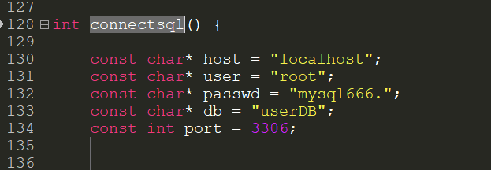
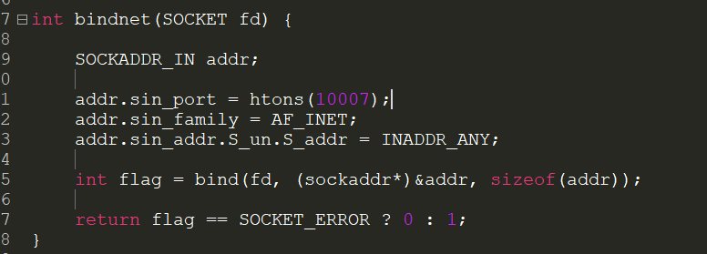
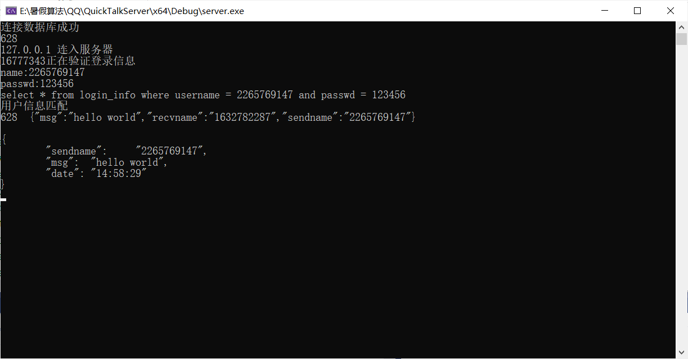

# QuickTalkServer

## 简介

这是QuickTalk的服务端,  负责客户端的通信,注册,修改密码,  需要注意就是, 这个服务端只能跑在Windows端, 它使用了Windows的库,是一个控制台窗口

## 使用

### 创建数据库

将userdb.sql 脚本执行, 建立好数据库和表

### 修改连接信息

在main.cpp中找到connectsql函数, 修改自己对应数据库信息



修改监听端口



使用自己想要监听的端口  例如 把10007 改成8080

### 编译项目

#### 使用IDE(推荐)

使用vs2019打开项目编译运行即可

#### 使用命令行

```
cl main.cpp /EHsc /Fe:server.exe
```

> 这里可能会出现编译器找不到Windows的那些头文件的情况

## 展示

